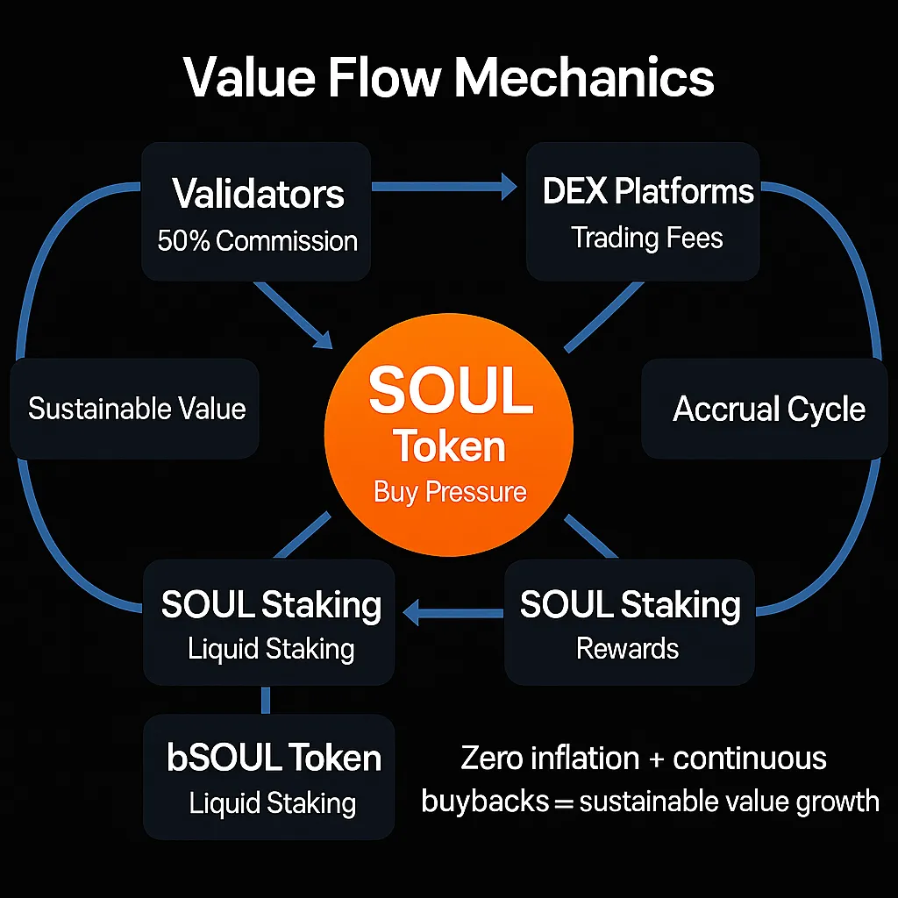

# $SOUL

More often than not DeFi is a soulless endeavour. Funded by VCs and designed to drum up liquidity for them to empty their bags on retail. BackBone Labs is creating a paradigm shift to change this and put the community first.

## Why does $SOUL exist?

Traditionally, liquidity has been under the control of a select group of people (VCs), with profits siphoned away from the community and funnelled into their own pockets. Meanwhile, outsiders, community members, and retail investors are scrambling at the behest of these VCs. We at BackBone Labs and our uniting community seek to rectify this by establishing self-sustaining systems and ensuring ongoing incentives for LST liquidity pairs providing users with a sustainable source of yield for their liquidity positions. This initiative integrates NFTs and innovative staking token mechanisms to foster sustainability and fairness.

Unlike inflationary tokens, $SOUL is designed to be a reliable store of value. It maintains its worth over time and insures a diverse yield mechanism via the [GraveDiggers](../bassets-and-minting-tokens/gravedigger-lsts/) across the Cosmos, ensuring that holders can trust in the long-term stability and viability of their investments. This non-inflationary nature makes $SOUL a cornerstone for sustainable economic growth within the ecosystem.

$SOUL is more than just a token; it's a transformative force within the NFT and DeFi landscapes. By addressing liquidity issues, providing real yield, and fostering community engagement, $SOUL ensures a fairer, more sustainable, and more inclusive financial ecosystem. Join BackBone Labs in revolutionizing the way we interact with digital assets and creating a future where everyone can benefit from the growth and innovation in the NFT and DeFi spaces.\\

<figure><figcaption>
$SOUL Logo
</figcaption></figure>

## Tokenomics

* **Max Supply:** 21,000,000
* **BackBone Labs Community:** 26.2%
* **$WHALE holder allocation:** 47.6%
* **SOUL Foundation:** 7.9%
* **Team Allocation:** 7.9%
* **Liquidity (PoL):** 5.2%

<figure><figcaption></figcaption></figure>

## Value Accrual

$SOUL token stakers will receive a portion of the revenue of all the liquid staking [GraveDiggers](https://app.backbonelabs.io/gravedigger/dashboard) that launch across Cosmos. Each GraveDigger revenue is divided into portions and split, with 100% of the revenue going back to the community. The revenue breakdown is as follows:

**40%** - $SOUL tokens stakers\
6**0%** - GraveDigger NFTs

With the $SOUL token receiving 40% of the Revenue from each GraveDigger the rewards will be diversified across multiple Cosmos chains with no single point of failure. $SOUL stakers will have a continuous and sustainable yield.

<figure><figcaption></figcaption></figure>

## Further $SOUL token Info


